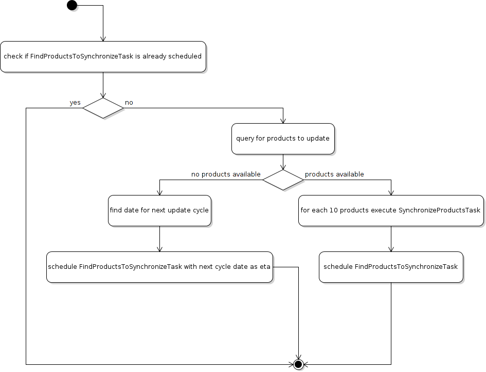

[](https://travis-ci.org/ponyriders/django-amazon-price-monitor) [](https://coveralls.io/r/ponyriders/django-amazon-price-monitor?branch=master) [](https://waffle.io/ponyriders/django-amazon-price-monitor)

<!-- START doctoc generated TOC please keep comment here to allow auto update -->
<!-- DON'T EDIT THIS SECTION, INSTEAD RE-RUN doctoc TO UPDATE -->
**Table of Contents**  *generated with [DocToc](https://github.com/thlorenz/doctoc)*

- [django-amazon-price-monitor](#django-amazon-price-monitor)
  - [What does it do?](#what-does-it-do)
  - [Setup](#setup)
    - [Prerequisites](#prerequisites)
    - [Included angular libraries](#included-angular-libraries)
    - [Basic setup](#basic-setup)
    - [Settings](#settings)
      - [Must have settings](#must-have-settings)
        - [Celery](#celery)
        - [Rest-Framework](#rest-framework)
        - [AWS and Product Advertising API credentials](#aws-and-product-advertising-api-credentials)
        - [Images protocol and domain](#images-protocol-and-domain)
      - [Optional settings](#optional-settings)
        - [Product synchronization](#product-synchronization)
        - [Notifications](#notifications)
        - [Caching](#caching)
    - [Celery settings](#celery-settings)
  - [Management Commands](#management-commands)
  - [Loggers](#loggers)
    - [price_monitor](#price_monitor)
    - [price_monitor.product_advertising_api](#price_monitorproduct_advertising_api)
    - [price_monitor.utils](#price_monitorutils)
  - [Internals](#internals)
    - [Model graph](#model-graph)
    - [Product advertising api synchronization](#product-advertising-api-synchronization)
      - [Task workflow](#task-workflow)

<!-- END doctoc generated TOC please keep comment here to allow auto update -->

# django-amazon-price-monitor

Monitors prices of Amazon products via Product Advertising API.

## Basic structure

This is a reusable Django app that can be plugged into your project.
It consists basically of this parts:

  - Models
  - Frontend components
  - Angular Frontend API
  - Amazon API component

### Models

  - Product
    - representation of an Amazon product
  - Price
    - representation of a price of an Amazon product at a specific time
  - Subscription
    - subscribe to a product at a specific price with an email notification

### Frontend components

The frontend displays all subscribed products with additional information and some graphs for price history.

We currently have 2 implementations, the (old) static one and the (new) one with AngularJS. After some issues have been resolved in the AngularJS implementation, we will remove the old static one.

The components feature the followung

  - static version
     - list products
     - add subscriptions
     - delete subscriptions
  - AngularJS version
     - list products
     - show product details
     - show product price graphs
     - add subscriptions
     - adjust subscription price value
     - delete subscriptions

### Angular Frontend API

Simply the API consumed by AngularJS, based on Django REST Framework.

### Amazon API component

Fetches product information from Amazon Product Advertising API through several tasks powered by Celery and weaves the data into the models.

## Setup

### Prerequisites

- Python 3.3, 3.4
- see requirements.txt

### Included angular libraries

- angular-django-rest-resource ([commit: 81d752b363668d674201c09d7a2ce6f418a44f13](https://github.com/blacklocus/angular-django-rest-resource/tree/81d752b363668d674201c09d7a2ce6f418a44f13))

### Basic setup

Add the following apps to *INSTALLED_APPS*:

    INSTALLED_APPS = (
        ...
        'price_monitor',
        'price_monitor.product_advertising_api',
        'rest_framework',
    )

Then migrate:

    python manage.py migrate
    
Adjust the settings appropiately, [see next chapter](#settings).

### Settings

_The values of the following displayed settings are their default values. If the value is '...' then there is no default value._ 

#### Must have settings

The following settings are absolutely necessary to the price monitor running, please set them:

##### Celery

You need to have a broker and a result backend set.

    BROKER_URL = ...
    CELERY_RESULT_BACKEND = ...
      
    # some additional settings
    CELERY_ACCEPT_CONTENT = ['pickle', 'json']
    CELERY_CHORD_PROPAGATES = True

##### Rest-Framework

We use Rest-Framework for Angular frontend:

    REST_FRAMEWORK = {
        'PAGINATE_BY': 50,
        'PAGINATE_BY_PARAM': 'page_size',
        'MAX_PAGINATE_BY': 100,
    }

##### AWS and Product Advertising API credentials

```
# your Amazon Web Services access key id
PRICE_MONITOR_AWS_ACCESS_KEY_ID = '...'

# your Amazon Web Services secret access key
PRICE_MONITOR_AWS_SECRET_ACCESS_KEY = '...'

# the region endpoint you want to use.
# Typically the country you'll run the price monitor in.
# possible values: CA, CN, DE, ES, FR, IT, JP, UK, US
PRICE_MONITOR_AMAZON_PRODUCT_API_REGION = '...'

# the assoc tag of the Amazon Product Advertising API
PRICE_MONITOR_AMAZON_PRODUCT_API_ASSOC_TAG = '...'
```

##### Images protocol and domain

```
# if to use the HTTPS URLs for Amazon images.
# if you're running the monitor on SSL, set this to True
# INFO:
#  Product images are served directly from Amazon.
#  This is a restriction when using the Amazon Product Advertising API
PRICE_MONITOR_IMAGES_USE_SSL = True

# domain to use for image serving.
# typically analog to the api region following the URL pattern
#  https://images-<REGION>.ssl-images-amazon.com
PRICE_MONITOR_AMAZON_SSL_IMAGE_DOMAIN = 'https://images-eu.ssl-images-amazon.com'
```

#### Optional settings

The following settings can be adjusted but come with reasonable default values.

##### Product synchronization
 
```
# time after which products shall be refreshed
# Amazon only allows caching up to 24 hours, so the maximum value is 1440!
PRICE_MONITOR_AMAZON_PRODUCT_REFRESH_THRESHOLD_MINUTES = 720  # 12 hours
```

##### Notifications

To be able to send out the notification emails, set up a proper email backend (see
[Django documentation](https://docs.djangoproject.com/en/1.5/topics/email/#topic-email-backends)).

```
# time after which to notify the user again about a price limit hit (in minutes)
PRICE_MONITOR_SUBSCRIPTION_RENOTIFICATION_MINUTES = 10080  # 7 days

# sender address of the notification email
PRICE_MONITOR_EMAIL_SENDER = 'noreply@localhost'

# currency name to use on notifications
PRICE_MONITOR_DEFAULT_CURRENCY = 'EUR'

# subject and body of the notification emails
gettext = lambda x: x
PRICE_MONITOR_I18N_EMAIL_NOTIFICATION_SUBJECT = gettext(
    'Price limit for %(product)s reached'
)
PRICE_MONITOR_I18N_EMAIL_NOTIFICATION_BODY = gettext(
    'The price limit of %(price_limit)0.2f %(currency)s has been reached for the '
    'article "%(product_title)s" - the current price is %(price)0.2f %(currency)s.'
    '\n\nPlease support our platform by using this '
    'link for buying: %(link)s\n\n\nRegards,\nThe Team'
)

# name of the site in notifications
PRICE_MONITOR_SITENAME = 'Price Monitor'
```

##### Caching

```
# key of cache (according to project config) to use for graphs
# None disables caching.
PRICE_MONITOR_GRAPH_CACHE_NAME = None

# prefix for cache key used for graphs
PRICE_MONITOR_GRAPH_CACHE_KEY_PREFIX = 'graph_'
```

### Celery settings

To be able to run the required Celery tasks, Celery itself has to be set up. Please see the
[Celery Documentation](http://docs.celeryproject.org/en/latest/index.html) about how to setup the whole thing. You'll need a broker and a result backend
configured.


## Management Commands
There is a management command to batch create a number of products by providing their ASIN:

    python manage.py price_monitor_batch_create_products "<ASIN1>,<ASIN2>,<ASIN3>"


## Loggers

### price_monitor

The app uses the logger "price_monitor" to log all error and info messages that are not included within a dedicated other logger.
Please see the [Django logging documentation](https://docs.djangoproject.com/en/1.6/topics/logging/ "Django logging documentation") for how to setup loggers.

### price_monitor.product_advertising_api

Logger for everything related to the ProductAdvertisingAPI wrapper class that accesses the Amazon Product Advertising API through bottlenose.

### price_monitor.utils

Logger for the utils module.


## Internals

### Model graph


### Product advertising api synchronization

#### Task workflow


